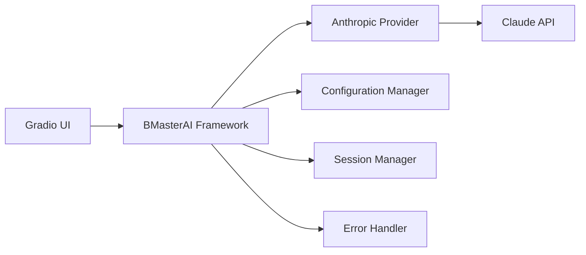

# BMasterAI Gradio Example - Anthropic Integration

A comprehensive example demonstrating how to build a modern web interface for the BMasterAI framework using Gradio and Anthropic's Claude models.

## 🌟 Features

- **Interactive Chat Interface**: Real-time conversation with Claude models
- **Dynamic Configuration**: Adjust model settings without restarting
- **Multiple Models**: Support for all Claude variants (3.5 Sonnet, Haiku, Opus)
- **Session Management**: Track conversation history and statistics
- **Production Ready**: Docker and Kubernetes deployment configurations
- **Responsive Design**: Modern, mobile-friendly interface

## 🚀 Quick Start

### Prerequisites

- Python 3.11+
- Anthropic API Key ([Get one here](https://console.anthropic.com/))

### Local Development

1. **Navigate to the example directory**
   ```bash
   cd examples/gradio-anthropic
   ```

2. **Install dependencies**
   ```bash
   pip install -r requirements.txt
   ```

3. **Set up environment**
   ```bash
   cp .env.example .env
   # Edit .env and add your ANTHROPIC_API_KEY
   ```

4. **Run the application**
   ```bash
   python gradio-app-bmasterai.py
   ```

5. **Open your browser**
   Navigate to http://localhost:7860

## 🐳 Docker Deployment

### Build and Run
```bash
docker build -t bmasterai-gradio .
docker run -p 7860:7860 -e ANTHROPIC_API_KEY=your-key bmasterai-gradio
```

### Using Docker Compose
```bash
# Set your API key in .env file
echo "ANTHROPIC_API_KEY=your-api-key" > .env

# Start the application
docker-compose up -d
```

## ☸️ Kubernetes Deployment

1. **Update the secret with your API key**
   ```bash
   kubectl apply -f kubernetes.yaml
   kubectl patch secret bmasterai-secrets -n bmasterai \
     -p '{"stringData":{"anthropic-api-key":"your-actual-api-key"}}'
   ```

2. **Access the application**
   ```bash
   kubectl get ingress -n bmasterai
   # Or use port-forward for testing
   kubectl port-forward service/bmasterai-gradio-service 7860:80 -n bmasterai
   ```

## ⚙️ Configuration

### Environment Variables

| Variable | Default | Description |
|----------|---------|-------------|
| `ANTHROPIC_API_KEY` | - | **Required**: Your Anthropic API key |
| `MODEL_NAME` | `claude-3-5-sonnet-20241022` | Claude model to use |
| `MAX_TOKENS` | `4096` | Maximum response length |
| `TEMPERATURE` | `0.7` | Response creativity (0.0-1.0) |
| `SYSTEM_PROMPT` | Default | Custom system prompt |
| `GRADIO_SERVER_NAME` | `0.0.0.0` | Server bind address |
| `GRADIO_SERVER_PORT` | `7860` | Server port |
| `GRADIO_SHARE` | `false` | Enable public sharing |

### Supported Models

- **claude-3-5-sonnet-20241022** - Latest, most capable model
- **claude-3-5-haiku-20241022** - Fast and efficient
- **claude-3-opus-20240229** - Most powerful model
- **claude-3-sonnet-20240229** - Balanced performance
- **claude-3-haiku-20240307** - Quick responses

## 🏗️ Architecture

The example demonstrates the BMasterAI framework architecture:



### Key Components

1. **BMasterAIFramework**: Core framework class handling API interactions
2. **BMasterAIConfig**: Configuration management with validation
3. **BMasterAIGradioApp**: Gradio interface wrapper and event handling
4. **Provider Abstraction**: Extensible design for multiple AI providers

## 📚 Code Structure

```
gradio-anthropic/
├── gradio-app-bmasterai.py    # Main application
├── requirements.txt           # Python dependencies
├── Dockerfile                # Container configuration
├── docker-compose.yml        # Multi-container setup
├── kubernetes.yaml           # K8s deployment manifests
├── .env.example              # Environment template
└── README.md                 # This file
```

## 🔧 Customization

### Adding New Models

Edit the model dropdown choices in `gradio-app-bmasterai.py`:

```python
model_dropdown = gr.Dropdown(
    choices=[
        "claude-3-5-sonnet-20241022",
        "your-new-model",  # Add here
        # ... existing models
    ],
    # ...
)
```

### Custom System Prompts

Modify the default system prompt:

```python
config = BMasterAIConfig(
    # ...
    system_prompt="You are a specialized AI assistant for [your use case]."
)
```

### UI Customization

The interface uses custom CSS that can be modified in the `create_interface` method:

```python
custom_css = """
.gradio-container {
    /* Your custom styles */
}
"""
```

## 🧪 Testing

Run the application locally and test:

1. **Basic Chat**: Send a simple message
2. **Model Switching**: Change models in settings
3. **Parameter Adjustment**: Modify temperature and max tokens
4. **Session Management**: Clear chat and session history
5. **Error Handling**: Test with invalid API keys

## 🚀 Production Considerations

### Security
- Store API keys in secure secret management systems
- Use HTTPS in production deployments
- Implement rate limiting for public deployments
- Consider authentication for sensitive use cases

### Monitoring
- Enable logging for troubleshooting
- Monitor API usage and costs
- Set up health checks and alerting
- Track user engagement metrics

### Scaling
- Use horizontal pod autoscaling in Kubernetes
- Implement caching for frequently requested content
- Consider load balancing for high traffic
- Monitor resource usage and optimize accordingly

## 🐛 Troubleshooting

### Common Issues

1. **API Key Not Found**
   ```
   Error: Anthropic API key is required
   ```
   **Solution**: Set the `ANTHROPIC_API_KEY` environment variable

2. **Connection Errors**
   ```
   Error: Network error: Connection timeout
   ```
   **Solution**: Check internet connection and API key validity

3. **Model Not Found**
   ```
   Error: Model not found
   ```
   **Solution**: Verify the model name is correct and available

4. **Port Already in Use**
   ```
   Error: Address already in use
   ```
   **Solution**: Change the port or stop the conflicting service

### Debug Mode

Enable debug logging:

```python
import logging
logging.basicConfig(level=logging.DEBUG)
```

## 📈 Performance Tips

1. **Optimize Token Usage**: Set appropriate `max_tokens` values
2. **Cache Responses**: Implement caching for repeated queries
3. **Batch Requests**: Group multiple requests when possible
4. **Monitor Latency**: Track response times and optimize
5. **Resource Limits**: Set appropriate memory and CPU limits

## 🤝 Contributing

To contribute to this example:

1. Fork the BMasterAI repository
2. Create a feature branch for your changes
3. Test your modifications thoroughly
4. Submit a pull request with detailed description

## 📄 License

This example is part of the BMasterAI framework and is licensed under the MIT License.

## 🔗 Related Resources

- [BMasterAI Documentation](../../docs/)
- [Anthropic API Documentation](https://docs.anthropic.com/)
- [Gradio Documentation](https://gradio.app/docs/)
- [Docker Documentation](https://docs.docker.com/)
- [Kubernetes Documentation](https://kubernetes.io/docs/)

---

**Need Help?** Open an issue in the [BMasterAI repository](https://github.com/travis-burmaster/bmasterai/issues) or join our community discussions.
